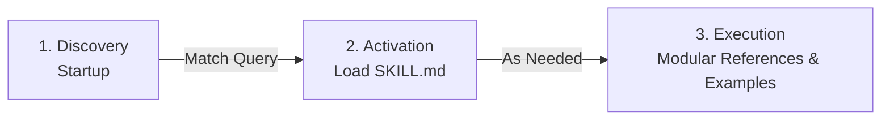

# Leaflet — Agent Skill 🍃🤖

[](https://agentskills.io/specification)
[](https://code.claude.com)
[](https://github.com/vercel-labs/skills)
[-199900)](https://leafletjs.com/)
[](./LICENSE.md)

> Open-source **Leaflet** AI skill for coding assistants (Claude Code, Cursor, Antigravity, GitHub Copilot, Windsurf, Roo Code, Gemini CLI). Built in accordance with the open **[Agent Skills Specification](https://agentskills.io/)**.

Maintained by **[MapSnippets](https://mapsnippets.org/)** — Open-source geospatial snippets, guides, and agent tools.

---

🌐 [Website](https://mapsnippets.org/) &nbsp; 📚 [Leaflet Documentation](https://leafletjs.com/reference.html) &nbsp; 📋 [Agent Skills Standard](https://agentskills.io/)

---

<br>

<details>
<summary><b>Table of Contents</b></summary>
<ul>
<li><a href="#-overview--capabilities">Overview & Capabilities</a></li>
<li><a href="#-how-agent-skills-work">How Agent Skills Work</a></li>
<li><a href="#-example-prompts-that-trigger-this-skill">Example Prompts That Trigger This Skill</a></li>
<li><a href="#-installation">Installation</a></li>
<li><a href="#-repository-architecture">Repository Architecture</a></li>
<li><a href="#-quickstart-examples">Quickstart Examples</a></li>
<li><a href="#-basemap-api-keys">Basemap API Keys</a></li>
<li><a href="#-evaluation--validation">Evaluation & Validation</a></li>
<li><a href="#links">Links</a></li>
<li><a href="#-contributing">Contributing</a></li>
<li><a href="#-license">License</a></li>
</ul>
</details>

<br>

## 💡 Overview & Capabilities

An **Agent Skill** is on-demand domain expertise: AI assistants load it dynamically when a task requires specialized geospatial knowledge, replacing guesswork and hallucinated legacy APIs with verified patterns.

When activated for **Leaflet**, this skill guides the agent to:

- **Generate pure native Leaflet code** (v1.9.4 LTS) with robust container lifecycle handling, touch event compatibility, and `invalidateSize` responsive resize management.
- **Render modern vector tiles in Leaflet** using standard plugins like `@maplibre/maplibre-gl-leaflet` (`L.maplibreGL`) with MapTiler `streets-v4` styles for high-DPI rendering and crisp vector typography.
- **Implement high-DPI raster tile layers** with `tileSize: 512`, `zoomOffset: -1`, and `@2x` retina scaling to prevent blurry pixelation.
- **Cluster high-density markers** cleanly using `leaflet.markercluster` with custom SVG cluster badges, spiderfy child expansions, and chunked loading.
- **Prevent coordinate order inversion bugs** — strictly enforces Leaflet's `[latitude, longitude]` API convention vs GeoJSON's `[longitude, latitude]`.
- **Manage custom map panes & z-indexes** (`createPane`) to keep interactive labels, highlight boundaries, and vector overlays ordered properly.
- **Integrate enterprise geospatial layers** — OGC WMS with `GetFeatureInfo` click inspections, Cloud-Optimized GeoTIFF raster layers (`georaster-layer-for-leaflet`), and Flat Cartesian maps (`L.CRS.Simple`).

<br>

## 🧠 How Agent Skills Work

This skill follows the **[Agent Skills open format](https://agentskills.io/)**, utilizing a **three-tier progressive disclosure model** to minimize context overhead:



1. **Discovery (Startup)**: The agent only inspects the YAML frontmatter `name` and `description` (~50 tokens).
2. **Activation (Task Identified)**: When your prompt mentions Leaflet, raster tiles, marker clusters, or Leaflet plugins, the agent loads `skills/leaflet/SKILL.md` (< 2,650 tokens).
3. **Execution (Deep Dive)**: The agent traverses targeted guides in `references/` or runnable recipes in `examples/` on demand, without polluting your context window.

<br>

## 🎯 Example Prompts That Trigger This Skill

You don't need special commands to use this skill. Any natural language request matching its capabilities will trigger it:

- *"How do I add MapTiler vector tiles to a Leaflet map using @maplibre/maplibre-gl-leaflet?"*
- *"Create a Leaflet marker cluster group with custom HTML icons that spiderfies on click."*
- *"Why is my Leaflet map grey when loaded in a Bootstrap tab or modal, and how do I fix it with invalidateSize?"*
- *"Add a GeoJSON layer with custom hover styles, tooltips, and click zoom to bounds in Leaflet."*
- *"Implement a drawing toolbar in Leaflet using Geoman so users can draw and edit polygons."*

<br>

## 📦 Installation

### Option 1: Universal — via Skills CLI (Recommended)

Works across Claude Code, Cursor, Windsurf, Gemini CLI, Antigravity, and dozens of other AI coding tools. The [Skills CLI](https://github.com/vercel-labs/skills) auto-detects your active environments:

```bash
npx skills add mapsnippets/leaflet-skill
```

<br>

### Option 2: Claude Code Plugin

Install directly via the Claude Code plugin marketplace:

```bash
/plugin marketplace add mapsnippets/leaflet-skill
/plugin install leaflet-skill@leaflet-skill
/reload-plugins
```

<br>

### Option 3: Manual Installation by Client

Copy or symlink the `skills/leaflet` directory into your agent's configured skills path:

| Agent / Tool | Target Directory | Install Command |
| :--- | :--- | :--- |
| **Cursor** | `.cursor/skills/leaflet` | `mkdir -p .cursor/skills && cp -r skills/leaflet .cursor/skills/` |
| **VS Code / Copilot** | `.agents/skills/leaflet` | `mkdir -p .agents/skills && cp -r skills/leaflet .agents/skills/` |
| **Gemini CLI / Antigravity** | `~/.gemini/skills/leaflet` | `mkdir -p ~/.gemini/skills && cp -r skills/leaflet ~/.gemini/skills/` |
| **Windsurf (Cascade)** | `.windsurf/skills/leaflet` | `mkdir -p .windsurf/skills && cp -r skills/leaflet .windsurf/skills/` |
| **Roo Code / Cline** | `.roo/skills/leaflet` | `mkdir -p .roo/skills && cp -r skills/leaflet .roo/skills/` |
| **OpenHands** | `.agents/skills/leaflet` | `mkdir -p .agents/skills && cp -r skills/leaflet .agents/skills/` |

<br>

## 📘 Repository Architecture

This repository strictly conforms to the [Agent Skills specification](https://agentskills.io/specification) (`dir_name == name`):

```text
mapsnippets/leaflet-skill/
├── .claude-plugin/
│   ├── marketplace.json    — Claude Code marketplace catalog manifest (v1.1.0)
│   └── plugin.json         — Claude Code plugin manifest & metadata (v1.1.0)
├── skills/
│   └── leaflet/
│       ├── SKILL.md        — Entry point prompt & progressive disclosure router (< 200 lines)
│       ├── evals/
│       │   └── evals.json  — Machine-readable evaluation benchmarks (5 core test cases)
│       ├── examples/       — 29 standalone runnable recipes (HTML/CSS/JS)
│       │   ├── INDEX.md    — Curated categorized catalog of all recipes
│       │   └── ...         — Vector tiles, marker clustering, GeoJSON, WMS, Geoman
│       └── references/     — 20 deep technical reference guides & API specifications
│           ├── INDEX.md    — Searchable index of references
│           ├── versions.md — Single source of truth for library releases & styles
│           └── ...         — coordinate conventions, panes, clustering, vector plugins
├── README.md               — Project documentation & setup guide
└── LICENSE.md              — MIT License
```

<br>

## 🗺️ Quickstart Examples

### Vector Tiles in Leaflet (Recommended):

```javascript
import L from "leaflet";
import "@maplibre/maplibre-gl-leaflet";
import "leaflet/dist/leaflet.css";

const map = L.map("map").setView([50.0755, 14.4378], 13); // [latitude, longitude]

L.maplibreGL({
  style: "https://api.maptiler.com/maps/streets-v4/style.json?key=YOUR_API_KEY"
}).addTo(map);
```

<br>

### High-DPI Raster Tiles via `L.tileLayer`:

```javascript
import L from "leaflet";
import "leaflet/dist/leaflet.css";

const map = L.map("map").setView([50.0755, 14.4378], 13); // [latitude, longitude]

L.tileLayer("https://api.maptiler.com/maps/streets-v4/{z}/{x}/{y}.png?key=YOUR_API_KEY", {
  tileSize: 512,
  zoomOffset: -1,
  minZoom: 1,
  maxZoom: 19,
  attribution: '<a href="https://www.maptiler.com/copyright/" target="_blank">&copy; MapTiler</a> <a href="https://www.openstreetmap.org/copyright" target="_blank">&copy; OpenStreetMap contributors</a>',
  crossOrigin: true
}).addTo(map);
```

<br>

## 🔑 Basemap API Keys

The vector and raster tile recipes in this skill use MapTiler Planet v4 basemap styles. To run recipes with live vector tiles:
- Follow the guide on [how to get a free MapTiler API Key](https://docs.maptiler.com/cloud/api/authentication-key/) (free tier includes 100,000 monthly requests).
- Replace `YOUR_API_KEY` in the snippet with your active key.

<br>

## 🧪 Evaluation & Validation

This skill includes an automated evaluation benchmark suite in `skills/leaflet/evals/evals.json` covering:
1. Vector Basemap Integration (`@maplibre/maplibre-gl-leaflet`)
2. High-DPI Raster Tile Layers (`tileSize: 512`, `zoomOffset: -1`)
3. GeoJSON Feature Styling & Lat/Lng Inversion Prevention
4. High-Density Marker Clustering (`leaflet.markercluster`)
5. Custom Panes & Z-Index Layer Ordering (`createPane`)

To validate compliance against the Agent Skills specification using the reference validator:

```bash
npx @agentskills/skills-ref validate skills/leaflet
```

<br>

## Links

- 🌐 [MapSnippets Community](https://mapsnippets.org/)
- 📚 [Leaflet Documentation](https://leafletjs.com/reference.html)
- 📋 [Agent Skills Specification](https://agentskills.io/)
- 🐙 [GitHub Repository](https://github.com/mapsnippets/leaflet-skill)

<br>

## 🤝 Contributing

Contributions are welcome! If you have optimized recipes, updated API references, or new evaluation benchmarks:
1. Fork the repository.
2. Ensure relative links in `skills/leaflet/SKILL.md` remain strictly valid.
3. Validate your changes with `npx @agentskills/skills-ref validate skills/leaflet`.
4. Submit a Pull Request.

<br>

## 📄 License

This project is licensed under the MIT License — see the [LICENSE](./LICENSE.md) file for details.

<br>

<p align="center">
  Maintained with ❤️ by <a href="https://mapsnippets.org/">MapSnippets</a> — Open web mapping tools & agent skills.
</p>
